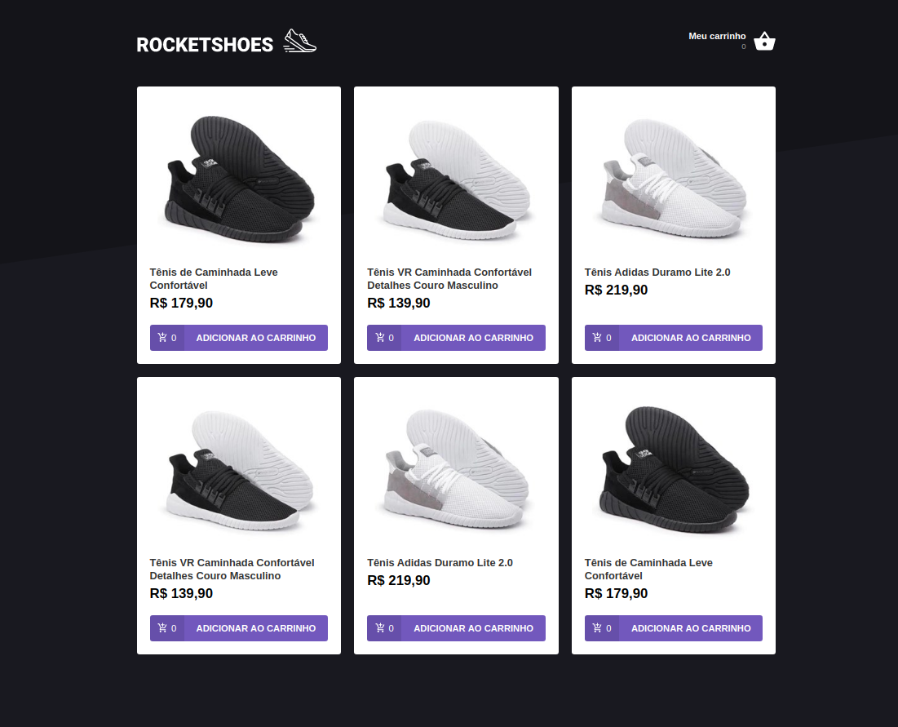

<h1 align="center">
  
</h1>

<h3 align="center">Rocketshoes - Frontend</h3>

ReactJS - Redux - Redux Saga

## :rocket: Projeto

Projeto do bootcamp GoStack - Rocketseat, utilizando **ReactJS, Redux, Redux Saga, json-server e reactotron**.

RocketShoes é uma aplicação de compras online. A aplicação Web e a aplicação mobile podem ser usadas pelos usuários que querem efetuarem compras de maneira simples e fácil.

## Instalação e execução

1. Faça um clone desse repositório;
2. Rode `yarn` para instalar as dependências;
3. Inicie o json-server `json-server server.json -p 3333`
4. Rode `yarn start` para iniciar a aplicação.
